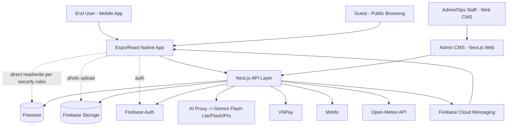
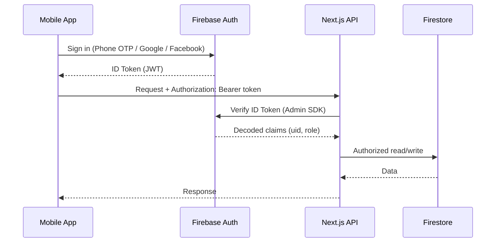
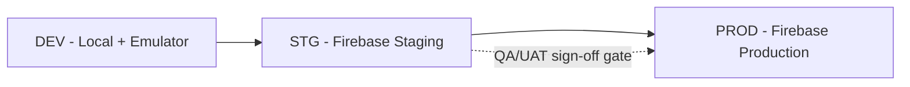

# Solution Architecture — Wardro (Personal Fashion Operating System)

Version: 1.0
Date: 2026-07-12

Status: Ready for Technical Review

Author: BA OS — Solution Architect

Source Artifacts: Product Vision v2.0 · 07_design_brief_v2.0.md · 02_brd_v2.0.md · 04_user_stories_v2.0.md · 05_acceptance_criteria_v2.0.md · 10_navigation_flow_map_v1.md · Decision addendum (Wear Count from Event, 2026-07-12) · Existing "Your Closet" codebase (Firestore/Zustand/Expo Router)

Next Phase: Dev Prompt Generator

---

## 1. Executive Architecture Summary

Wardro is a B2C mobile app (Expo/React Native) backed by Firebase (Auth, Firestore, Storage) and a Next.js API layer that proxies all AI calls. The existing "Your Closet" codebase already implements this stack with 23 Firestore collections, Zustand state, and Expo Router — this architecture **extends and reconciles** that codebase rather than replacing it, with one confirmed breaking change (membership tier enum rebuild: `free/premium/elite` → `free/pro/premium`).

Architecture pattern: **Modular Monolith** — a single Next.js backend service organized into clearly-bounded modules (Auth, Closet, Outfit/AI, Try-On, Events, Community, Membership/Payment, Missions, Admin), each with its own API route namespace and Firestore collection ownership, deployed as one unit. This is deliberately chosen over microservices given team size (1 PO/BA + Technical Lead + QA Lead) and MVP stage — module boundaries are designed so a future split to services remains possible without a rewrite.

Implementation strategy: 8 development packages ordered by dependency (Auth/Foundation first, AI Model Routing early since 5 features depend on it, Admin CMS last except for the 2 admin capabilities that gate other features). Deployment strategy: single environment matrix (DEV → STG → PROD) on Firebase Hosting + Cloud Functions/Next.js API routes, with the AI proxy and payment webhooks isolated behind server-only environment variables per BRD 1.2.3–1.2.4.

---

## 2. Business Architecture

### Business Objectives
Activation (fast closet digitization) · Daily engagement (North Star: Weekly Outfits Worn) · Differentiation (Try-On + Event Planning) · Community loop (3-layer moat) · Monetization (Free→Pro→Premium) · Retention (Missions) · Personalization depth (Style Profile) · Revenue diversification (Affiliate) · Operational control (Admin CMS) · Trust without forced signup (Guest Mode).

### Business Capabilities
AI-assisted wardrobe digitization · AI outfit recommendation & wear tracking · AI virtual try-on · Event planning with outfit linking · C2C marketplace (Pass đồ) · Tiered AI model routing · Subscription billing (VNPay/MoMo) · Missions/rewards/referral · Style profiling · Affiliate shopping · Admin operations console.

### Business Domains
**Core:** Wardrobe (Closet, Outfit, Try-On) — the wardrobe graph moat. **Supporting:** Event Planning, Community/Marketplace, Missions, Style Profile, Shopping/Affiliate. **Generic:** Auth, Membership/Payment, Notifications, Admin/CMS.

### Critical Processes
Registration/Login (2.1) · AI Closet Core Flow (2.2) · Outfit Generation + Confirm-Worn (2.3-equiv) · Virtual Try-On (Section 9 flow) · List an Item for Trade (Section 9 flow) · Guest→Registered Conversion (Section 9 flow) · Admin Moderation (Section 9 flow) · **Event Wear Confirmation (new, Story 10.5)**.

### Business Constraints
Vietnamese market only (VNPay/MoMo, Vietnamese-language UI throughout — confirmed via Stitch review discipline) · Nghị định 13/2023 data protection compliance (right-to-delete cascade, Section 3.1.7) · No escrow/secured payment in Phase 1 (explicit disclosure required) · AI cost per active user is a survival-level KPI — every AI call must be tier-routed and logged.

### Success Metrics
North Star: Weekly Outfits Worn. Supporting: Activation rate ≥30–40%, DAU/MAU ≥25%, Free→Premium conversion 3–5% Year 1, AI cost per active user under financial-model threshold, AI tag-correction rate <20–25% (model-sufficiency gate).

---

## 3. Business Traceability

| Business Goal | Requirement (BRD) | Story | Module | Service |
|---|---|---|---|---|
| Activation | 3.2 AI Closet | 2.1–2.6 | Closet Module | `/api/closet/*`, `/api/ai/clothing/*` |
| Daily engagement (North Star) | 3.3 Home/Outfit Gen | 3.1–3.4, **10.5 (new)** | Outfit Module, Event Module | `/api/outfits/*`, `/api/events/*` |
| Differentiation | 3.9 Try-On, 3.10 Events | 9.1–9.5, 10.1–10.5 | Try-On Module, Event Module | `/api/ai/tryon/*`, `/api/events/*` |
| Community loop | 3.11 Marketplace | 11.1–11.6 | Community Module | `/api/listings/*`, `/api/messages/*` |
| Monetization | 3.4 Membership, 3.14 Payment | 4.1–4.6, 14.1–14.3 | Membership Module, Payment Module | `/api/membership/*`, `/api/payments/*` |
| Retention | 3.5 Missions | 5.1–5.8 | Missions Module | `/api/missions/*`, `/api/referrals/*` |
| Personalization | 3.13 Style Profile | 13.1–13.5 | Profile Module | `/api/profile/style/*` |
| Revenue diversification | 3.12 Shopping/Affiliate | 12.1–12.4 | Shopping Module | `/api/shopping/*` |
| Operational control | 3.17 Admin CMS | 17.1–17.16 | Admin Module | `/api/admin/*` |
| Trust w/o signup | 3.16 Guest Mode | 16.1–16.3 | Auth Module (cross-cutting) | Firestore public-read rules |

No unmapped modules — every module traces to at least one business goal above.

---

## 4. Architecture Decision

**Selected: Modular Monolith** (Next.js API routes as the backend, deployed as a single service; Expo/React Native mobile client; Firebase managed services for data/auth/storage).

**Rationale:** The existing codebase is already a modular monolith on this exact stack — adopting it as the architecture pattern rather than introducing microservices avoids a rewrite, matches team size (single Technical Lead), and Firebase/Firestore's serverless scaling model means the "scale" argument for microservices doesn't apply here (Firestore scales horizontally regardless of API topology).

**Trade-offs accepted:** Slower to independently scale/deploy individual modules (e.g., AI proxy can't scale independently of Admin CMS) — acceptable at MVP scale (target 500–5,000 users Year 1). Single point of deployment failure — mitigated by Vercel/Firebase's built-in rollback and the Deployment Architecture (Section 16 below).

**Alternatives considered:**
- *Microservices* — rejected: premature for team size and user scale; would multiply DevOps overhead the team doesn't have capacity for.
- *Serverless-only (pure Cloud Functions, no Next.js)* — rejected: the existing codebase already uses Next.js API routes successfully; switching would be a rewrite with no clear benefit, since Next.js API routes on Vercel/Firebase already get function-level serverless scaling per route.
- *BaaS-only (no custom backend, mobile calls Firestore directly)* — rejected: AI proxy, payment webhook handling, and AI Model Routing logic require a trusted server-side layer (BRD 1.2.3 explicitly mandates AI keys never reach the mobile client).

---

## 5. Technology Stack Recommendation

| Layer | Technology | Rationale |
|---|---|---|
| Mobile Frontend | Expo / React Native / TypeScript / Expo Router | Already implemented in existing codebase; cross-platform iOS/Android from one codebase, fast iteration via Expo Go/EAS. |
| Mobile State | Zustand | Already implemented; lightweight, avoids Redux boilerplate for a team of this size. |
| Backend API | Next.js API Routes (Node.js/TypeScript) | Already implemented; colocates admin web + API in one deployable, server-only env vars protect AI/payment secrets. |
| Database | Firestore (NoSQL, document) | Already implemented; native real-time listeners suit chat/notification features, scales without ops overhead, tight Firebase Auth integration. |
| Auth | Firebase Auth (Phone OTP, Google, Facebook) | Already implemented; Email/Password being removed per BRD 1.3.3 — native SDK support for all 3 remaining providers on both platforms. |
| Storage | Firebase Storage | Already implemented; direct integration with Firestore security rules, signed URLs for private closet photos. |
| AI Provider | Gemini family (Flash-Lite/Flash/Pro classes) via server-side proxy | Per Product Vision AI Model Tiering strategy; Flash-Lite for extraction/classification tasks, Flash/Pro for generation-quality tasks. |
| Payments | VNPay, MoMo (Apple/Google Pay deferred Phase 1.1) | BRD 3.14, Vietnamese market standard, PO-confirmed priority. |
| Weather | Open-Meteo API | Already integrated; free, no API key, sufficient accuracy for outfit recommendation context. |
| Push Notifications | Firebase Cloud Messaging | Native Firebase integration, already the implied channel per BRD 3.6/Story 10.4 (push-only, no SMS/email). |
| Hosting/CI-CD | Vercel or Firebase Hosting + Cloud Functions (Technical Lead to confirm which) | Both compatible with Next.js; flagged as ADR-08 below since existing codebase's exact host is unconfirmed in reviewed material. |
| Monitoring | Firebase Crashlytics (mobile) + Vercel/Cloud Logging (backend) | Native to the chosen stack, no new vendor onboarding needed at MVP stage. |
| Analytics | Firebase Analytics + custom `shopping_events`/`ai_logs` collections | Firebase Analytics for engagement funnels; custom collections already exist for business-specific event tracking (BRD 3.12.3). |

---

## 6. System Context Architecture

---

## 7. Module Architecture

| Module | Purpose | Responsibilities | Dependencies | Priority |
|---|---|---|---|---|
| **Auth** | Identity & Guest Mode | Phone OTP/Google/Facebook sign-in, session mgmt, guest public-read gating | Firebase Auth | P0 |
| **Closet** | Wardrobe digitization | Item CRUD, bulk upload, AI tag review, item detail incl. wear-count display | AI Routing, Storage | P0 |
| **Outfit** | Outfit generation & library | Daily suggestion generation, confirm-worn, favorite/hide, `timesWorn` increment | AI Routing, Closet | P0 |
| **Try-On** | Virtual try-on | Scene select, quota check, AI image generation, save/share | AI Routing, Membership (quota) | P0 |
| **Event** | Event planning + wear confirmation | Event CRUD, outfit linking, reminders, **wear-confirm banner + bulk `timesWorn` increment (Story 10.5, new)** | Outfit, Notifications | P1 |
| **Community** | Marketplace (Pass đồ) | Listing CRUD, moderation queue, messages, trade offers, transactions | Closet (source item), Admin | P0 |
| **Shopping** | Affiliate | Product feed, click/impression tracking | AI Routing (missingItems signal) | P1 |
| **Membership** | Tiering & quotas | Tier comparison, `plan_limits` read, quota enforcement middleware | Payment | P0 |
| **Payment** | Billing | VNPay/MoMo checkout, subscription lifecycle | Membership | P0 |
| **Missions** | Retention/referral | Mission progress, claim rewards, referral link generation/tracking | Notifications | P1 |
| **Profile** | Style profile | Initial survey, basic/advanced preferences | — | P0/P1 |
| **Notifications** | Push delivery | Template management, scheduled jobs (event reminders, wear-confirm prompts, mission alerts) | FCM | P1 |
| **AI Routing** (shared/infra) | Model selection | Reads `admin_settings` routing config, resolves (feature,tier)→model, fallback, cost logging to `ai_logs` | — (foundational — no upstream dependency) | **P0, build first among AI-touching modules** |
| **Admin** | Ops console | RBAC, all 16 admin surfaces via shared `AdminCollectionPage` pattern | All modules (read/write across collections) | P1 (except Membership/AI Routing config sub-scope, which is P0-blocking) |

---

## 8. Domain Model

### Core Domain: Wardrobe
**Entities:** `clothes` (closet item), `outfits` (AI-generated or user-saved combination), `events` (planned occasion). **Relationships:** an `outfit` references N `clothes` by ID; an `event` references N `outfits` via `linkedOutfitIds`; both `clothes` and `outfits` carry `timesWorn`, incremented from two independent triggers (Home confirm-worn action, and — new — Event wear-confirmation, which increments all linked outfits at once).

### Core Domain: Try-On
**Entities:** `tryon_sessions` (implicit — generation request/result, may already exist in codebase under a different name; **flag for Technical Lead confirmation**, see Knowledge Gaps). **Relationships:** references a `clothes`/`outfits` selection + a scene + a user photo; produces a generated image asset in Storage.

### Supporting Domain: Community/Marketplace
**Entities:** `listings`, `marketplace_messages`, `trade_offers`, `listing_reports`, `transactions`. **Relationships:** a `listing` references a source `clothes` item (Knowledge Gap: BRD doesn't define behavior if source item is deleted post-listing — Solution Architect decision below in Section 18); a `transaction` is created on completed sale, referencing the `listing`.

### Supporting Domain: Membership & Payment
**Entities:** `plan_limits` (config), `subscriptions` (user state). **Relationships:** `users.tier` denormalized from active `subscriptions` for fast read-path quota checks; `subscriptions` is the source of truth.

### Supporting Domain: Missions & Referral
**Entities:** `missions` (config), `user_missions` (progress), `referrals` (new collection, Story 5.8). **Relationships:** `referrals.referrerId`/`refereeId` link two `users`; a completed referral triggers a `user_missions` reward claim.

### Supporting Domain: Style Profile
**Entities:** embedded on `users` document (`styleProfile`, `advancedPreferences` sub-objects) rather than separate collection — matches existing schema pattern (denormalized profile data for fast outfit-generation read access).

### Generic Domain: Admin/Ops
**Entities:** `admin_settings` (AI routing config + other system config), `admin_logs` (audit trail), `cms_content`, `support_tickets`, `adminUsers` (RBAC).

### Generic Domain: AI Observability
**Entities:** `ai_logs` — every AI call logs `feature`, `tier`, `modelUsed`, `costEstimate`, `fallbackUsed`, `quotaChargeEligible`. This is the data backbone for the AI-cost-per-user KPI and the tag-correction-rate model-sufficiency gate.

---

## 9. Integration Architecture

| System | Purpose | Protocol | Auth | Data Flow | Failure Handling | Retry | Monitoring |
|---|---|---|---|---|---|---|---|
| Firebase Auth | Identity | Firebase SDK | Provider OAuth/OTP | Bi-directional (client SDK + Admin SDK server verify) | Standard Firebase error codes surfaced to UI | N/A (SDK-managed) | Firebase Console |
| AI Proxy (Gemini) | Clothing detect/enhance, outfit recommend, try-on gen, style analysis | HTTPS REST, server-side only | API key (server env var, never client-exposed) | Request: image/context → Response: structured JSON (tags) or image asset | Auto-retry x3 (BRD 3.2.2.2), then error state, no silent mock fallback in prod | 3 attempts, exponential backoff recommended | `ai_logs` collection (custom) |
| VNPay | Payment checkout | HTTPS redirect + IPN webhook | Merchant secret (server-side) | Order create → redirect → IPN callback confirms | Failed/cancelled → return to Payment Prepare with non-blaming message (AC 83) | Webhook retry per VNPay's own policy | `admin_logs`, Payments admin report |
| MoMo | Payment checkout | HTTPS redirect + IPN webhook | Merchant secret (server-side) | Same pattern as VNPay | Same as VNPay | Same as VNPay | Same as VNPay |
| Open-Meteo | Weather for Home/Outfit Gen | HTTPS REST, no key | None (public API) | Lat/long → current + forecast weather | Cache last-known weather on failure, don't block outfit generation entirely | 1 retry, then degrade gracefully | Basic error logging |
| Firebase Cloud Messaging | Push notifications | Firebase SDK | Server key (server-side) | Event/mission/notification trigger → push payload | Failed sends logged, not retried indefinitely (avoid duplicate spam) | No retry beyond FCM's own delivery guarantee | `notifications` collection status field |

---

## 10. Data Architecture

### Data Domains
Identity (`users`, `adminUsers`) · Wardrobe (`clothes`, `outfits`, `events`) · Commerce (`listings`, `transactions`, `subscriptions`, `plan_limits`) · Engagement (`missions`, `user_missions`, `referrals`, `notifications`) · AI Observability (`ai_logs`) · Content/Ops (`cms_content`, `admin_settings`, `admin_logs`, `support_tickets`, `trends`).

### Data Ownership
Each module (Section 7) owns writes to its primary collection(s); cross-module reads are allowed (e.g., Admin reads everything) but cross-module writes go through the owning module's API, never direct Firestore writes from another module's client code — enforced via Firestore Security Rules scoped per collection.

### Data Flow
Mobile client → (public-read collections: direct Firestore read, per Guest Mode rules) or (private/write actions: Next.js API → Firestore) → Admin CMS reads/writes broadly for moderation/config.

### Data Lifecycle
Most collections: create → update → soft-delete (`status` field pattern, e.g. `outfits.status: active/hidden/removed` per Story 15.4) rather than hard delete, except full account deletion (BRD 3.1.7.2) which hard-deletes across 8 named collections.

### Data Retention
Personal data retained until account deletion request (Nghị định 13/2023 compliance); anonymized/aggregated statistics retained indefinitely for product analytics. `ai_logs` retention: recommend 90-day rolling window for cost logs (not specified in BRD — flagged as Knowledge Gap).

### Data Classification
**Public:** `trends`, `cms_content` (published), approved `listings`, `plan_limits`. **Internal:** `ai_logs`, `admin_logs`, aggregated analytics. **Confidential:** `users` (profile, style data), `clothes`, `outfits`, `events`, `marketplace_messages`. **Restricted:** payment/subscription records, `adminUsers` credentials-adjacent data.

---

## 11. Database Design

See `12_database_design.md` for full collection schemas, field-level detail, and the Mermaid ER diagram.

---

## 12. API Architecture

See `13_api_spec.md` for full endpoint specification.

**API Domains:** `/api/auth/*` (session-adjacent, mostly client-SDK-driven), `/api/closet/*`, `/api/outfits/*`, `/api/ai/*` (all AI-touching calls, routed through AI Routing module), `/api/events/*`, `/api/listings/*`, `/api/messages/*`, `/api/membership/*`, `/api/payments/*`, `/api/missions/*`, `/api/referrals/*`, `/api/profile/*`, `/api/admin/*`.

**Authentication Model:** Firebase ID token (JWT) in `Authorization: Bearer` header, verified server-side via Firebase Admin SDK on every non-public endpoint.

**Authorization Rules:** Role check (`user`/`admin` + `adminUsers.role` sub-permission) enforced per-route in API middleware, mirrored in Firestore Security Rules as defense-in-depth for any direct client reads.

**Error Standards:** Consistent envelope `{ error: { code, message, details? } }`, HTTP status mirrors error class (400 validation, 401 unauthenticated, 403 forbidden/quota-exceeded, 404, 429 rate-limited, 500).

**Versioning Strategy:** URI-free versioning for MVP (single implicit v1) — introduce `/api/v2/*` only if a breaking change is needed post-launch; premature to version now.

**Rate Limiting Strategy:** AI endpoints rate-limited per-user via quota check against `plan_limits` (business-logic rate limit, not infra-level). General API rate limiting (DDoS-class) deferred to hosting platform defaults (Vercel/Firebase) for MVP.

**API Governance Rules:** every new AI-touching endpoint MUST call through the AI Routing module (no hardcoded model IDs in feature code) — this is the single most important governance rule given BRD 3.4.6's centrality to the cost strategy.

---

## 13. Authentication & Authorization

### Authentication Flow
Firebase Auth handles Phone OTP (native/reCAPTCHA), Google, Facebook sign-in client-side; ID token passed to backend on every API call; Admin SDK verifies token server-side per request (no server-side session store needed — stateless JWT verification).

### Authorization Model
Two-tier: (1) `user` vs `admin` custom claim on the Firebase Auth user record; (2) for admins, a `role` field on `adminUsers` document providing fine-grained permission (per-module access) — **exact role list is a Knowledge Gap (BRD 3.17.2, flagged Medium priority in Design Brief Section 21)**, recommend Solution Architect propose a starter set below.

### RBAC (proposed starter roles — pending PO/Technical Lead confirmation)
`super_admin` (all modules) · `ops_admin` (Community moderation, Support, Users) · `content_admin` (CMS Content, Trends, Missions) · `finance_admin` (Payments, Transactions, Membership config).

### Permission Matrix
Reuses BRD Section 7 (Guest/User/Pro-Premium/Admin) as the base; RBAC roles above further scope Admin-level access per module.

### Session Strategy
Stateless — Firebase ID token (1hr expiry, auto-refreshed by SDK), no server-side session storage required.

### Token Strategy
Firebase ID token (JWT) for user identity; separate server-only API keys/secrets (AI provider, VNPay, MoMo) stored as environment variables, never in Firestore or client bundle.

### Security Controls
Firestore Security Rules as defense-in-depth (even though most writes route through API, rules prevent any bypass); server-side AI/payment secrets (BRD 1.2.3); explicit escrow-absence disclosure before first marketplace transaction (BRD 3.11.7); `EXPO_PUBLIC_DEMO_MODE`/`EXPO_PUBLIC_DEMO_AUTH_BYPASS` hard-disabled in production builds (BRD 4.1.2).

---

## 14. AI Architecture

### LLM Layer
Gemini family, tiered by (feature, membership tier) per BRD Section 9 Appendix — Flash-Lite for classification/extraction (`clothing_detection`, base `outfit_recommend`), Flash/Pro for generation-quality tasks (`clothing_enhance`, upgraded `outfit_recommend`, `virtual_tryon`, `style_profile_analyze`).

### Prompt Layer
Feature-specific prompt templates server-side (not client-configurable); Fashion Knowledge Base (FKB) content injected via context caching for shared reference data (Product Vision: "-90% input lặp" cost strategy) — recommend implementing context caching for FKB in Package 2 since it's a direct, proven cost lever.

### Agent Layer
Not applicable — Wardro's AI usage is single-call feature invocations (detect, enhance, recommend, generate, analyze), not multi-step agentic workflows, per BRD scope.

### Memory Layer
Not applicable at MVP — no conversational AI memory requirement identified in BRD.

### Knowledge Layer
Fashion Knowledge Base (FKB) — curated taxonomy grounding clothing detection and trend outputs (BRD Glossary); owned/edited via Admin > Trends.

### RAG Layer
Not explicitly required by BRD — FKB grounding is closer to structured taxonomy injection than full RAG; flag as Knowledge Gap if Technical Lead determines retrieval-based grounding is needed for accuracy.

### Evaluation Layer
Tag-correction-rate metric (Product KPI) is the primary AI-quality evaluation signal — needs instrumentation: every user correction to an AI-suggested tag should log a correction event tied to the original `ai_logs` entry, enabling the <20–25% threshold gate to actually be measured.

### AI Monitoring
`ai_logs` collection (already scoped in BRD 1.3.1) is both the cost-monitoring AND quality-monitoring backbone — Admin > Analytics dashboard (Story 17.16) should surface AI cost per active user as a headline metric per Product Vision's "KPI sống còn" framing.

### AI Safety Controls
No user-generated content is fed back into prompts without moderation context (Community listings go through Admin approval before any AI-adjacent surfacing, e.g., in Shopping recommendations) — no explicit BRD requirement here, but recommended as a default safety posture; flag for Technical Lead sign-off.

---

## 15. Non-Functional Architecture

| NFR | Requirement | Target | Implementation Strategy |
|---|---|---|---|
| Performance (AI response) | BRD Section 7 | 5–8s | Flash-Lite class default; loading skeleton not spinner (Design Brief Section 12) |
| Performance (Try-On generation) | BRD Section 7 | 15–20s | Branded progress moment UI; async generation, poll or listen for completion |
| Reliability | BRD Section 7 | 99.5% uptime | Firebase managed services SLA + Vercel/Firebase Hosting SLA; no custom infra to maintain |
| Security | Nghị định 13/2023 | Full compliance | Cascade delete (3.1.7.2), server-only secrets, Firestore rules defense-in-depth |
| Accessibility | WCAG 2.2 AA | Full compliance | Design Brief Section 15 already scoped; text labels alongside color/icon distinctions |
| Maintainability | N/A (architecture principle) | Modular monolith with clear module boundaries | Section 7 module table as the enforced boundary; one Firestore collection = one owning module |
| Observability | N/A | Full AI cost/quality visibility | `ai_logs` + Admin Analytics dashboard |
| Disaster Recovery | Not specified in BRD | Recommend: daily Firestore export to Cloud Storage, 30-day retention | Flagged as Knowledge Gap — no explicit BRD requirement, recommending a baseline |

---

## 16. Deployment Architecture

### Environment Strategy
`DEV` (local Expo + Firebase emulator suite) → `STG` (staging Firebase project, sandboxed VNPay/MoMo per BRD 1.2.4) → `PROD` (production Firebase project, live payment credentials).

### Infrastructure Layout
Mobile: Expo EAS Build → App Store / Google Play. Backend: Next.js app (API routes + Admin CMS web) on Vercel or Firebase Hosting/Cloud Functions (**ADR-08 — Technical Lead to confirm which host the existing codebase already targets**, since reviewed material doesn't confirm this explicitly). Database/Storage/Auth: Firebase managed (single project per environment).

### Deployment Flow
Git push → CI (lint/typecheck/test) → deploy to STG automatically → manual promotion to PROD after QA sign-off (per existing Playwright/UAT gate discipline in the BA OS pipeline).

### Release Flow
Mobile: EAS Build + Store submission (subject to App Store/Play review latency — plan releases accordingly, not same-day). Backend: near-instant via Vercel/Firebase deploy — this asymmetry means **backend-only fixes should be preferred over app-store-gated fixes wherever architecturally possible** (reinforces the Admin-configurable `plan_limits`/`admin_settings` pattern already in the BRD).

### Rollback Strategy
Backend: Vercel/Firebase instant rollback to previous deploy. Mobile: EAS supports rollback of OTA-updatable JS changes only; native changes require a new store submission (no true rollback) — flag this asymmetry to Technical Lead for release planning.

### Environment Matrix
| Env | Firebase Project | Payment Mode | AI Provider Mode | Purpose |
|---|---|---|---|---|
| DEV | Emulator Suite / dev project | Sandbox | Mock or low-quota real calls | Local development |
| STG | Staging project | Sandbox (VNPay/MoMo test mode) | Real (budget-capped) | QA/UAT before release |
| PROD | Production project | Live | Real | End users |

---

## 17. Observability Architecture

**Logging:** Vercel/Cloud Functions logs (backend), Firebase Crashlytics (mobile crash reporting). **Monitoring:** Firebase Performance Monitoring (mobile), Vercel Analytics or equivalent (backend response times). **Tracing:** Not required at MVP scale (single-service architecture, no distributed tracing complexity). **Alerting:** Recommend threshold alert on AI cost run-rate and on payment webhook failure rate — not specified in BRD, flagged as recommendation. **Analytics:** Firebase Analytics (engagement funnels) + custom `shopping_events`/`ai_logs` (business-specific). **Business Metrics:** Admin > Analytics dashboard surfaces Activation rate, DAU/MAU, tier conversion %, AI usage (BRD 3.17.16). **Error Tracking:** Sentry or Crashlytics-equivalent recommended for mobile (not explicitly named in reviewed codebase material — flag for Technical Lead confirmation). **Operational Dashboards:** Admin CMS Dashboard/Analytics (Story 17.16) is the primary ops-facing dashboard.

---

## 18. Architecture Decision Records (ADR)

| # | Decision | Options | Chosen | Rationale | Impact |
|---|---|---|---|---|---|
| ADR-01 | Overall architecture pattern | Monolith / Modular Monolith / Microservices | Modular Monolith | Matches existing codebase, team size, Firestore's built-in scaling | Low risk, fast to build on |
| ADR-02 | Membership tier data model | In-place relabel vs. full rebuild | Full rebuild (`free/pro/premium`, new enum) | PO decision D2 — old `elite` records need migration, not display-only change | Requires a one-time migration script/task in Package 1 |
| ADR-03 | AI Model Routing config location | Hardcoded in app / Hardcoded in backend / Admin-configurable (`admin_settings`) | Admin-configurable | BRD 3.4.6 explicitly requires no-redeploy tier adjustment | Adds one collection + admin UI, but this IS the core cost-control mechanism |
| ADR-04 | Wear-count trigger sources | Home confirm-worn only / Event-triggered only / Both (hybrid) | Both — Home confirm-worn (existing, Story 15.5) + Event wear-confirmation (new, Story 10.5) | PO decision 2026-07-12 — event completion should also feed the North Star metric without forcing a separate manual action | New `events.wearConfirmedAt` field; both paths write to the same `timesWorn` counters, so downstream analytics don't need to distinguish source |
| ADR-05 | Event wear-confirmation scope | Per-outfit confirm / Bulk confirm-all-linked | Bulk (all linked outfits confirmed together) | PO decision 2026-07-12 — simpler UX, avoids a second-order "which outfit did you actually wear" flow not currently designed | Simpler implementation; slight analytics imprecision accepted per PO |
| ADR-06 | Escrow / secured payment | Build now / Defer | Defer to Phase 2 | BRD 3.11.7 explicit PO decision | Marketplace transactions are trust-based in Phase 1; mandatory disclosure banner required before first transaction |
| ADR-07 | Listing behavior on source item deletion | Cascade-delete listing / Auto-archive listing / Block item deletion | **Auto-archive listing** (recommended new decision — BRD flagged this as unaddressed) | Deleting a closet item shouldn't silently break an active marketplace listing (bad for buyers mid-conversation); auto-archiving preserves message history while removing it from public feed | Adds one status transition (`listings.status: archived_source_deleted`); needs PO confirmation before Dev Prompt Generator locks this in |
| ADR-08 | Backend hosting target | Vercel / Firebase Hosting+Functions | **Not yet confirmed** — flagged for Technical Lead | Reviewed material doesn't state which host the existing "Your Closet" codebase already deploys to | Blocking item for Package 1 deployment setup |
| ADR-09 | Design-token source of truth when the Stitch export self-contradicts | Frontmatter tokens / Prose brand palette / Hybrid | **Prose brand palette** (Espresso `#1A1208`, Sand `#D4B896`, Linen `#F7F4F0`, White `#FFFFFF`) | `wardro/DESIGN.md` ships two irreconcilable palettes: its YAML frontmatter carries an auto-generated Material-3 set (`primary #000000`, `background #f9f9f9`) while its prose defines the brand and argues explicitly against pure white. 16 of the 18 exported Package 1/2/Home screens render the frontmatter palette; only Phone entry carries the full warm override and its config is hand-commented `/* Espresso per prompt */`, with Edit item half-overridden. The frontmatter therefore reads as Stitch's un-overridden default, not intent. The same split affects radius: every screen redefines the scale, so `rounded-full` is 9999px on Phone entry but 12px on Welcome; the prose ("Large Containers: `rounded-lg` (8px)") matches the frontmatter scale, so prose wins there too. PO decision 2026-07-17 | Frontmatter colours are unused. Tokens live in `mobile/src/theme/` as the single source; the export's generated screens are treated as layout/spacing reference only, never as colour truth. Anyone "fixing" the theme back to the frontmatter would silently de-brand the app |
| ADR-10 | Help/Support and Logout-confirm surface | Split to dedicated routes per Stitch / Keep inline in existing screens | **Keep inline** in `settings.tsx` / `profile.tsx`; Stitch mockups (`tr_gi_p_h_tr_wardro`, `x_c_nh_n_ng_xu_t_wardro`) used for content styling only | Stitch renders both as standalone screens, but neither exists as a separate screen in code today. Promoting them to routes is a navigation/IA change, which falls under R2 (Settings entry-point mismatch) in `10_navigation_flow_map_v1.md` — still pending PO decision. A visual-only restyle must not pre-empt an unapproved IA change. PO decision 2026-07-17 | Package 1 restyle stays purely visual. If R2 later approves the split, these two surfaces move to routes as a separate, explicitly-scoped change; the styling done now carries over unchanged |
| ADR-11 | Accent color scope: Espresso/Sand/Linen thuần hay có điểm nhấn riêng? | Thuần 3 màu neutral (ADR-09) / Neutral base + 1 accent hồng-plum riêng cho AI/hero | **Neutral base + accent riêng** | gradients.hero (Espresso→#2E2347 Plum→#8F395A) và colors.accent (#D85D84 Pink) được định nghĩa có chủ đích trong theme Bước 1, dùng riêng cho hero card + CTA/eyebrow liên quan tính năng AI — không phải màu lạc/hardcode. ADR-09 (prose Espresso/Sand/Linen) áp dụng cho nền/surface/text/component chung; accent hồng-plum là ngoại lệ có phạm vi hẹp, giới hạn ở điểm nhấn AI-hero, không lan ra toàn bộ UI. | Mọi package sau này khi thấy màu hồng/plum ở khu vực AI/hero: đây là chủ đích, không sửa về Espresso/Sand trừ khi có quyết định riêng thay đổi theme trung tâm (ngoài phạm vi restyle skin/layout thông thường) |

---

## 19. Risks & Mitigations

| Risk | Impact | Mitigation | Owner |
|---|---|---|---|
| ~~AI provider per-request model selection is an unverified assumption~~ — **RESOLVED 2026-07-14** | ~~High~~ — confirmed supported per official Gemini API documentation (per-request `model` param is standard REST behavior); no fallback path needed | N/A — closed. See Section 9 of BRD v2.3 for finalized model IDs/pricing per feature × tier | Closed |
| Listing source-item deletion edge case unaddressed in BRD | Medium — dangling reference risk in Community module | ADR-07 proposes auto-archive; needs explicit PO sign-off before Package 5 | PO |
| Admin RBAC role list undefined | Medium — blocks final Admin nav/permission design | Section 13 proposes a 4-role starter set; needs PO/Technical Lead confirmation before Package 8 | PO + Technical Lead |
| Backend hosting target unconfirmed | Medium — blocks Package 1 deployment pipeline setup | ADR-08 — must be confirmed before Dev Prompt Generator | Technical Lead |
| AI cost overrun if routing config misconfigured or Free-tier leakage occurs | High — threatens unit economics (confirmed Gemini price increase 2026-07-02) | `ai_logs` cost tracking + Admin dashboard alert threshold; AI Routing module is the single enforcement chokepoint | Technical Lead + PO |
| Wear-count double-counting (Home confirm + Event confirm for same real-world wear) | Low — minor analytics inflation, not a functional bug | Accepted risk per ADR-04/05; both counters increment independently, no dedup logic needed since this is an engagement metric, not billing-critical | PO (accepted) |
| Offline behavior unspecified (BRD Knowledge Gap) | Medium — Vietnamese mobile networks have real connectivity gaps | Lightweight "no connection" banner for Phase 1, full offline-first deferred to Phase 2 | PO (accepted, deferred) |
| Stitch export is internally inconsistent (two palettes, per-screen radius redefinitions, `n_ng_c_p_th_nh_c_ng_wardro` titled "LINEN" not "Wardro") | Medium — a later package could restyle against the wrong palette and silently de-brand the app | ADR-09 fixes prose as authoritative and `mobile/src/theme/` as the only token source; the branding defect is recorded against Package 6 so that screen is not used as a reference | BA (raise with Stitch); PO (accepted) |
| Help/Support + Logout-confirm remain inline while R2 is unresolved | Low — Package 1 visuals diverge from Stitch until the IA question is settled | ADR-10 — deliberate; revisit when R2 (Settings entry-point mismatch) receives PO decision | PO |

---

## 20. Development Packages

| # | Package | Scope | Dependencies | Priority | Complexity |
|---|---|---|---|---|---|
| 1 | **Foundation & Auth** | Firebase Auth (3 providers), Guest Mode gating, membership tier enum migration (ADR-02), base Firestore security rules, deployment pipeline setup (pending ADR-08) | None | P0 | Medium |
| 2 | **AI Routing + Closet** | `admin_settings` AI routing config, AI Routing resolver module, `ai_logs`, Closet CRUD, bulk upload, AI detect/enhance integration, Item Detail incl. wear-count display | Package 1 | P0 | High |
| 3 | **Outfit + Home + Try-On** | Outfit generation, confirm-worn (`timesWorn` v1), Outfit Library, Try-On flow (scene select, quota check, generation) | Package 2 | P0 | High |
| 4 | **Events (incl. wear-confirmation)** | Event CRUD, outfit linking, reminders (Story 10.4), wear-confirm banner + bulk timesWorn increment (Story 10.5, new) | Package 3 | P1 | Medium |
| 5 | **Community/Marketplace** | Listing CRUD, moderation, messages, trade offers, transactions, escrow-absence disclosure (ADR-06), source-item-deletion handling (ADR-07 — pending PO confirm) | Package 2 (closet items as listing source) | P0 | High |
| 6 | **Membership + Payment** | `plan_limits` config, tier comparison, VNPay/MoMo checkout, subscription lifecycle | Package 1 | P0 | Medium |
| 7 | **Missions + Referral + Style Profile + Shopping** | Missions/rewards, referral link+tracking, Style Survey + Advanced Preferences, Affiliate feed | Package 3 (AI Routing for style analysis) | P1 | Medium |
| 8 | **Admin CMS** | All 16 admin surfaces via shared `AdminCollectionPage` pattern, RBAC (pending role-list confirm), Analytics dashboard | All prior packages | P1 (Membership/AI-Routing config sub-scope is P0-blocking, build inside Package 2/6 instead of waiting) | High (breadth, not depth) |

---

## 21. Development Readiness Assessment

**Architecture Completeness:** High — all 17 BRD feature areas mapped to modules, all 51 screens (Design Brief) traceable to an API domain. **Implementation Readiness:** Partially Ready — 3 items block full readiness (AI per-request model selection unverified, backend host unconfirmed, RBAC role list undefined; none block starting Package 1). **Integration Readiness:** High — all 6 external integrations have defined protocols and failure handling. **Testing Readiness:** High — existing BA OS pipeline already has Playwright/UAT discipline. **Deployment Readiness:** Partially Ready — pending ADR-08 host confirmation.

**Status: Partially Ready**
Reason: No blocker prevents starting Package 1 (Foundation & Auth) immediately. Three specific items (ADR-08 hosting, AI per-request model selection verification, RBAC role list) need Technical Lead/PO input before Package 2 and Package 8 respectively — these are scoped, bounded gaps, not systemic architecture risk.

---

## 22. Dev Prompt Readiness

### Recommended Build Order
Package 1 → 2 → 3 → (4 and 6 can run in parallel, both depend only on Package 1/3) → 5 → 7 → 8.

### Development Units
Each package (Section 20) = one dev-prompt unit; within Package 2 and 3, split further by (a) AI Routing resolver as a standalone shared library task before feature integration, since 5 downstream features depend on it.

### Shared Components
AI Routing resolver (`resolveModel(feature, tier)`), Quota-check middleware (reads `plan_limits`, used by Closet/Outfit/Try-On), `AdminCollectionPage` generic component (already proven in existing codebase), `timesWorn` increment helper (shared by confirm-worn and event wear-confirmation — single function, two call sites, per ADR-04).

### API Packages
Grouped exactly per Section 12 API Domains — one Dev Prompt Generator pass per domain, in the build order above.

### Database Packages
Package 1: `users`, `adminUsers`, security rules foundation. Package 2: `clothes`, `admin_settings`, `ai_logs`. Package 3: `outfits`. Package 4: `events` (+ new `wearConfirmedAt` field). Package 5: `listings`, `marketplace_messages`, `trade_offers`, `listing_reports`, `transactions`. Package 6: `plan_limits`, `subscriptions`. Package 7: `missions`, `user_missions`, `referrals` (new), style-profile fields on `users`. Package 8: `cms_content`, `admin_logs`, `support_tickets`, `trends`.

### Integration Packages
Package 1: Firebase Auth. Package 2: AI proxy (detect/enhance). Package 3: AI proxy (recommend/tryon), Open-Meteo. Package 4: FCM (reminders + wear-confirm prompts). Package 5: none external. Package 6: VNPay, MoMo. Package 7: FCM (mission alerts).

### AI Packages
AI Routing resolver (Package 2, foundational) → clothing_detection + clothing_enhance (Package 2) → outfit_recommend (Package 3) → virtual_tryon (Package 3) → style_profile_analyze (Package 7).

### Testing Strategy
Playwright E2E per package following existing BA OS discipline; UAT scripts generated post-package via `uat-script-generator`; each package gate: Dev → Playwright → UAT → next package.

---

## 23. Knowledge Gaps

| Gap | Impact | Recommendation | Priority |
|---|---|---|---|
| ~~AI provider per-request model selection unverified~~ | ~~High~~ | **RESOLVED 2026-07-14** — confirmed supported per official Gemini API docs; see BRD v2.3 Section 9 for finalized model IDs/pricing. Removed from active gap list. | Closed |
| Backend hosting target unconfirmed (Vercel vs Firebase Hosting/Functions) | Medium — blocks deployment pipeline setup | Confirm with Technical Lead before Package 1 deployment config | Medium |
| Admin RBAC exact role-to-permission matrix | Medium — blocks final Admin nav design | Starter 4-role set proposed (Section 13); needs sign-off | Medium |
| Listing behavior on source-item deletion | Medium — dangling reference risk | ADR-07 proposes auto-archive; needs PO confirmation before Package 5 | Medium |
| Try-On generation result entity — exact collection name/shape not confirmed in reviewed codebase material | Low-Medium — needed for database design accuracy | Technical Lead to confirm existing collection name (assumed `tryon_sessions` in this doc) | Medium |
| `ai_logs` retention policy | Low | Recommend 90-day rolling retention; needs PO confirmation | Low |
| Disaster recovery / backup policy not specified in BRD | Low-Medium | Recommend daily Firestore export, 30-day retention as baseline | Low |
| Confidence threshold for "needs review" AI tag flagging (OI-3, carried from BRD) | Medium — affects Closet module review-queue logic | Still open per BRD; cannot resolve without PO/Technical Lead data-driven input | Medium |

---

## 24. Recommended Next BA OS Skill

**Recommend: Dev Prompt Generator**

Reason: Architecture, database design, and API spec are complete for both Package 1 and Package 2. AI per-request model selection is now confirmed (2026-07-14), so Package 2's AI Routing resolver and AI-touching prompts (P-07, P-11, P-12, P-14) no longer need to wait on a Technical Lead spike. Recommend proceeding with Package 2 Dev Prompts in full, while ADR-08 (hosting) and RBAC role confirmation happen in parallel with Technical Lead ahead of Package 1 deployment and Package 8 respectively.

---

## Executive Architecture Summary

**Architecture Pattern:** Modular Monolith (Next.js API + Expo/React Native + Firebase).
**Technology Strategy:** Extend existing "Your Closet" stack rather than rewrite; one confirmed breaking migration (membership tier enum).
**Key Modules:** 14 modules (Section 7), AI Routing is the foundational cross-cutting module 5 features depend on.
**Major Risks:** Backend host unconfirmed (Medium), RBAC roles undefined (Medium) — neither blocks Package 1. AI per-request model selection **resolved 2026-07-14** (confirmed supported; see BRD v2.3 Section 9) — no longer an open risk.
**Architecture Readiness:** Partially Ready (2 bounded, non-blocking gaps — down from 3).
**Implementation Readiness:** Ready — Package 1 in progress; Package 2 fully unblocked (AI Routing resolver no longer gated on a spike).
**Recommended Next Action:** Resolve remaining 2 Knowledge Gaps (hosting target, RBAC roles) with Technical Lead/PO in parallel before Package 1 deployment and Package 8 respectively; Package 2's AI-touching prompts (P-07, P-11, P-12, P-14) can proceed immediately.

---
## Review Checkpoint

Artifacts Ready:
- 11_solution_architecture.md
- 12_database_design.md
- 13_api_spec.md

Architecture Summary:

Pattern: Modular Monolith

Modules: 14

Integrations: 6 (Firebase Auth, AI Proxy, VNPay, MoMo, Open-Meteo, FCM)

Tables (Firestore collections): 27 (23 existing + `referrals` new + `wearConfirmedAt` field addition to `events`, no new collection for wear-count — reuses `timesWorn`)

APIs: 13 domains, ~70 endpoints (see 13_api_spec.md)

Architecture Readiness: Partially Ready — 2 bounded Knowledge Gaps (hosting, RBAC), neither blocking Package 1 or Package 2. AI model selection gap resolved 2026-07-14.

Implementation Readiness: Partially Ready — Package 1 (Foundation & Auth) can start immediately

Reply "approved" to proceed to Dev Prompt Generator, or provide architecture concerns.
